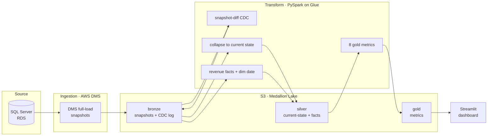

# Global Partners — Business Insights Data Platform

An end-to-end, AWS-native data platform that turns raw restaurant order data into
a unified view of **customer behavior, spending patterns, and business
performance** — Customer Lifetime Value (evolving daily), RFM segmentation, churn
risk, sales trends, loyalty impact, location performance, and discount
effectiveness — surfaced through an interactive Streamlit dashboard.

Built to a medallion (bronze → silver → gold) architecture with a full CDC
ingestion mechanism, all transformation logic in **PySpark on AWS Glue**, and a
GitHub Actions CI pipeline.

---

## Architecture



**Data flow:** SQL Server (RDS) → DMS full-load → **bronze** immutable snapshots →
snapshot-diff **CDC change log** → **silver** current-state + revenue facts →
**gold** metric tables → **Streamlit** dashboard.

---

## Why this stack

The assessment constrains the design to **AWS-native services, no external
licenses (no Snowflake/DBT), and all logic in PySpark**. Every choice follows
from that:

| Layer | Choice | Why |
|---|---|---|
| Ingestion | **AWS DMS** | AWS-native full-load + CDC from SQL Server to S3; managed, no code for extraction |
| Lake | **S3 (Parquet)** | cheap, durable, immutable bronze; columnar for Spark; the medallion substrate |
| CDC | **snapshot-diff in PySpark** | source runs SQL Server **Express** (no MS-CDC); we derive an I/U/D log by diffing snapshots, shaped exactly like log-based CDC — see below |
| Transform | **PySpark on AWS Glue 5.0** | serverless Spark (Spark 3.5), no cluster to manage, matches the "all logic in PySpark" rule; jobs stay pure PySpark so they're portable and unit-testable |
| Orchestration params | **date/batch partitioning** | incremental, late-arriving-data-safe CLV recompute windows |
| Dashboard | **Streamlit** | fast Python dashboards over the pre-aggregated gold tables |
| CI | **GitHub Actions** | runs the PySpark unit tests on every push (JDK 17 + Spark 3.5) |

---

## The CDC mechanism (and an honest caveat)

The intended production design is **DMS + SQL Server MS-CDC** (log-based). Because
the source runs **Express** (which has no CDC) and upgrading to Standard adds
license cost, this project uses a **snapshot-diff** substitute — but built to the
**exact log-based contract** so the code is the real thing:

- The change log carries DMS-CDC-style headers — `Op` (I/U/D), `cdc_seq` (an
  **LSN mimic**), `cdc_commit_ts` — and silver collapses on `cdc_seq` with the
  canonical *"latest sequence wins, drop tombstones"* merge.
- Swapping in a real MS-CDC feed later needs **zero changes to silver/gold** — only
  the producer changes.
- **Caveat:** snapshot-diff captures *net change between snapshots*, not intra-batch
  history (a row changed twice between snapshots shows once). For append-only
  restaurant orders this is immaterial; the trade-off is documented in full in
  [docs/cdc_design.md](docs/cdc_design.md).

---

## Data model

**Bronze** — raw immutable DMS snapshots + the derived CDC change log
(`cdc/<table>/dt=…`).

**Silver** — conformed, current-state:
- `current/order_items` (line-item grain), `current/order_item_options`,
  `current/date_dim` (a **generated** full-range calendar — the source only
  covered 2023 while orders span 2020-2024)
- `facts/order_line_items` (revenue split gross/discount/net),
  `facts/orders` (one row per order, with customer, revenue, `order_date`,
  `is_outlier`)

**Gold** — metric tables, one per business question (see below).

Reconciled volumes: **203,519** order items · **193,017** options · **131,328**
orders · **20,174** customers.

---

## Metrics & dashboards (Step 5 + 6)

| Gold table | Dashboard | Answers |
|---|---|---|
| `customer_clv_daily` + `clv_trends` | Overview — CLV | how CLV **evolves daily** (the primary goal) |
| `customer_clv_tiers` | Overview | High / Medium / Low = top 20% / mid 60% / bottom 20% |
| `customer_rfm` | Segmentation | RFM scores + segments (VIP / New / Churn Risk / Regular) |
| `churn_indicators` | Churn Risk | days-since-last, avg gap, spend trend, at-risk tagging (>45d) |
| `sales_daily` | Sales Trends | daily/weekly/monthly revenue × category × location + holidays |
| `loyalty_impact` | Loyalty | members vs non — AOV, repeat rate, CLV |
| `location_performance` | Location | revenue / AOV / orders per store, ranked |
| `discount_effectiveness` | Discounts | discounted vs full-price (none in this dataset) |

`customer_clv_daily` is **incremental and late-arriving-data-safe**: a late order
recomputes only the affected month partitions (`>= trunc(batch_min_order_date)`),
seeded by the prior cumulative — so history isn't recomputed.

---

## Repository layout

```
ingestion/     AWS DMS config (endpoints, task, table mappings) + runbook + CDC-enable SQL
jobs/          PySpark jobs, by medallion layer
  common/      table specs, CDC column contracts
  bronze/      snapshot_diff  (snapshots -> CDC change log)
  silver/      current_state, dim_date, order_facts
  gold/        clv_daily, clv_trends, rfm, clv_tiers, churn, sales_trends,
               loyalty_impact, location_performance, discount_effectiveness
tests/         PySpark unit tests (run in CI)
glue/          Glue IAM, packaging, job creation, pipeline runner + runbook
dashboard/     Streamlit app + runbook
docs/          cdc_design.md, data_quality.md
.github/       CI workflow
```

---

## Running it

Each stage has its own runbook:

1. **Ingestion** — [ingestion/README.md](ingestion/README.md): DMS full-load from
   RDS to S3 bronze.
2. **Pipeline on Glue** — [glue/README.md](glue/README.md): package the jobs,
   create the Glue jobs, run bronze → silver → gold.
3. **Dashboard** — [dashboard/README.md](dashboard/README.md):
   `python3 -m streamlit run app.py`.

Local tests (no AWS needed):
```bash
pip install -r requirements-dev.txt
pytest tests/ -v
```

---

## Data quality

The first real run surfaced issues invisible to unit tests — a 2023-only source
calendar vs 2020-2024 orders, extreme revenue outliers ($2.5M orders), 9.6% null
customers, and no discounts in the data. Each is handled and documented in
[docs/data_quality.md](docs/data_quality.md).

---

## Tech summary

**AWS DMS · S3 · AWS Glue (PySpark, Spark 3.5) · SQL Server (RDS) · Streamlit ·
GitHub Actions.** Medallion architecture, log-based-style CDC, incremental daily
CLV, 8 metric tables, 6 dashboards, unit-tested transforms.
