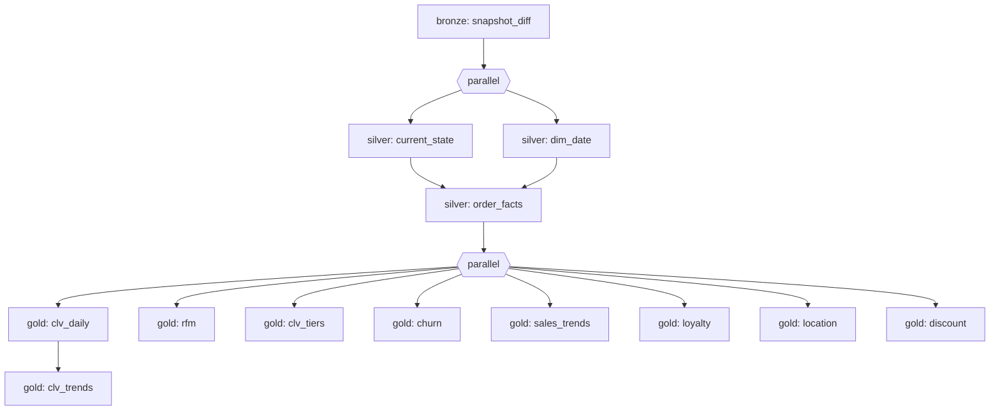

# Orchestration — AWS Step Functions

Chains the Glue jobs into one **medallion pipeline** with the correct
dependencies and parallelism, replacing manual `start-job-run` calls. Each state
runs a Glue job synchronously (`glue:startJobRun.sync`) and waits for it to
finish before the next.

## Why Step Functions
- **AWS-native**, serverless, no external scheduler (no Airflow license/infra).
- **Visual DAG** + per-state execution history and error surfacing.
- Native **`.sync` Glue integration** — no polling code, no Lambda glue.
- Built-in **retries** (transient Glue errors) and **catch** (fail fast on a real
  error) per state.

## The DAG



- **current_state** and **dim_date** run in parallel (independent).
- **order_facts** waits for both (it reads current-state; sales_trends later needs dim_date).
- All 8 gold metrics run in parallel; **clv_trends** is chained after **clv_daily** (it aggregates it).
- Any job failure → `Catch` → `PipelineFailed`; transient Glue errors retry (3×, exponential backoff).

Job arguments (`--bronze`, `--extra-py-files`, `--full` for CLV) come from each
Glue job's **DefaultArguments** — the state machine just names the jobs, so this
definition stays environment-agnostic.

## Deploy

```bash
cd orchestration
bash create_state_machine.sh      # creates the IAM role + state machine
```
Definition: [state_machine.asl.json](state_machine.asl.json) · IAM: [iam/](iam/).

**Console equivalent:** Step Functions → Create state machine → *Write with code* →
paste the ASL → set the execution role to `gpb-sfn-pipeline-role`.

## Run

```bash
SM=arn:aws:states:us-east-1:<ACCOUNT>:stateMachine:gpb-medallion-pipeline
aws stepfunctions start-execution --state-machine-arn "$SM"

# watch
aws stepfunctions describe-execution --execution-arn <EXEC_ARN> --query status
```
Or **Start execution** in the console and watch the graph light up per state.

## Schedule it (optional — EventBridge Scheduler)

Run daily at 06:00 UTC:
```bash
SM=arn:aws:states:us-east-1:<ACCOUNT>:stateMachine:gpb-medallion-pipeline
aws scheduler create-schedule --name gpb-daily-pipeline \
  --schedule-expression "cron(0 6 * * ? *)" \
  --flexible-time-window '{"Mode":"OFF"}' \
  --target "{\"Arn\":\"$SM\",\"RoleArn\":\"arn:aws:iam::<ACCOUNT>:role/gpb-sfn-pipeline-role\"}"
```
(The scheduler role also needs `states:StartExecution` on the state machine.)

## Incremental CLV (future)
The CLV job currently runs with `--full` (full recompute) via its DefaultArguments.
To make scheduled runs incremental, add a small pre-step (Lambda or Glue Python
Shell) that computes the batch's `min(order_date)` and pass it as
`--batch-min-order-date` in the `GoldClvDaily` state's `Arguments`. Everything
downstream already supports the windowed recompute — see
[../jobs/gold/customer_clv_daily.py](../jobs/gold/customer_clv_daily.py).
